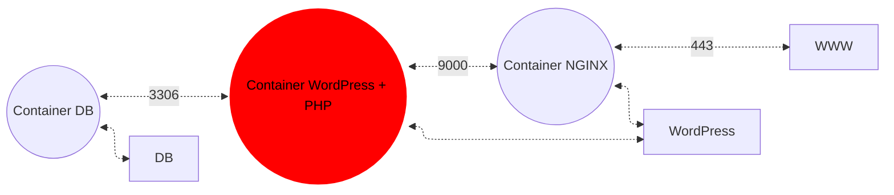
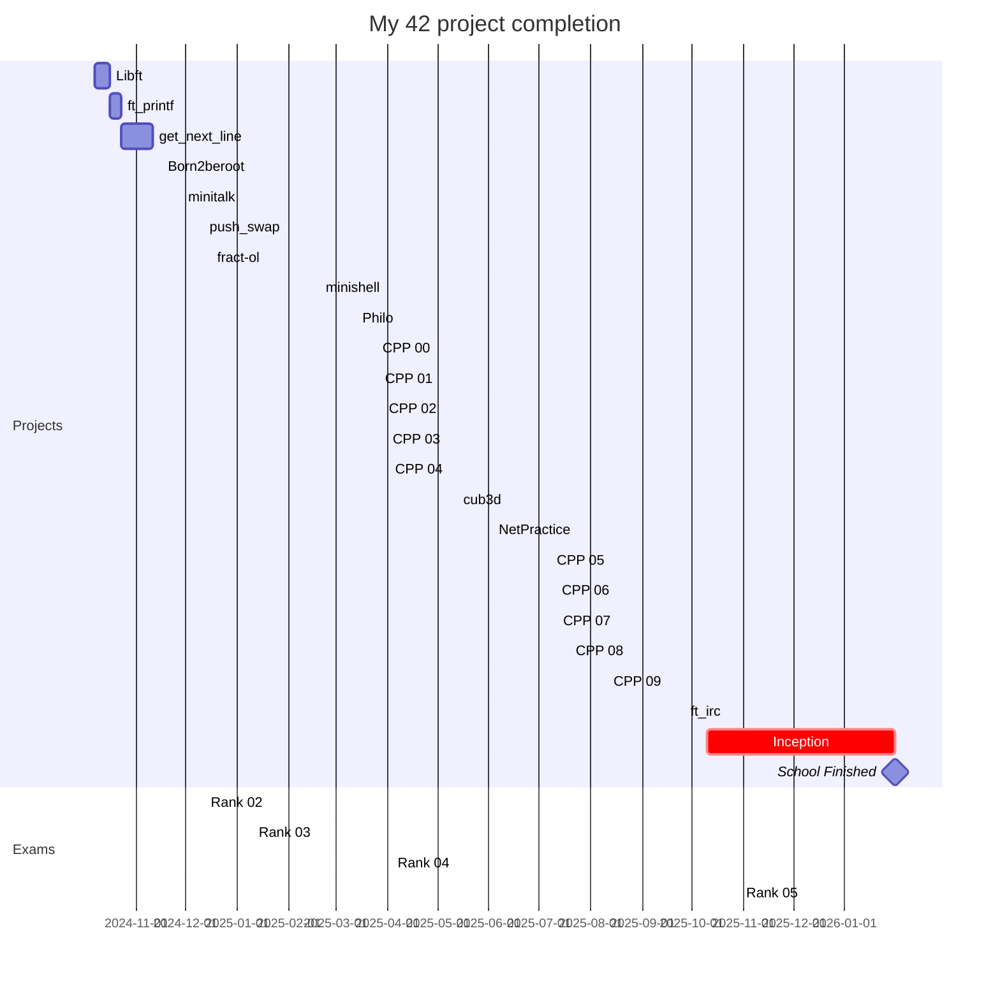

## Steps
1. Setup Nginx with basic config
	- Figure out where the config file is located and what it needs to contain

---

- Must write my own Dockerfiles that are called from docker-compose.yml

## Setup
### Nginx
With TLSv1.3

### WordPress with php-fpm
It must me installed and configured

### MariaDB

- docker-network for connecting containers
- restart containers automatically on crash

`--link` is forbidden

In WordPress database:
- 2 users, one of them administrator (username must not contain `admin`)

## Domain name
To simplify the process, you must configure your domain name to point to your local IP address.
This domain name must be rreimann.42.fr and will redirect to the IP address pointing to Robert's website

NGINX container must be the sole entry point into your infrastructure

## Have the following Docker images:
- MariaDB
- WordPress (php-fpm)
- Nginx
## Volumes (host machine "/home/rreimann/data folder"): 
- WordPress database
- WordPress website files

